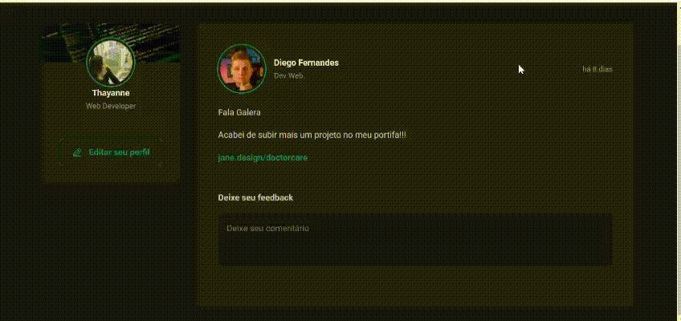

# Ignite Feed

O **Ignite Feed** é uma aplicação de feed de notícias onde os usuários podem publicar posts, interagir com eles através de comentários e curtir as postagens de outros usuários. A aplicação permite a visualização de comentários e a exclusão de comentários individuais, bem como o aumento do contador de curtidas.

## Tecnologias Utilizadas

- **React**
- **CSS Modules**
- **Date-fns**
- **JavaScript (ES6)**
- **React Hooks (useState)**
- **Phosphor-React**

## Funcionalidades

- **Publicação de Posts**: Permite que os usuários publiquem novos posts com título, conteúdo e links.
- **Comentários**: Usuários podem adicionar, visualizar e deletar comentários de cada post.
- **Curtir Comentários**: A cada clique no botão de curtidas, o contador de curtidas é incrementado.
- **Exibição de Data Relativa**: Os posts e comentários são exibidos com uma data relativa (exemplo: "há 1 hora").
- **Formulário de Comentários**: O usuário pode escrever um comentário e enviá-lo, com validação de campo obrigatório.

## Como Rodar o Projeto

Siga os passos abaixo para rodar este projeto localmente em sua máquina:

### Pré-requisitos

- Instalar [Node.js](https://nodejs.org/en/) 
- Instalar o [Git](https://git-scm.com/)
- Ter um editor de código como [VS Code](https://code.visualstudio.com/)

### Passos

1. Clone este repositório:
    ```bash
    git clone https://github.com/thayannecarrilho/ignite-feed.git
    ```

2. Navegue até o diretório do projeto:
    ```bash
    cd ignite-feed
    ```

3. Instale as dependências:
    ```bash
    npm install
    ```

4. Inicie o projeto:
    ```bash
    npm run dev
    ```

Agora o projeto deve estar rodando localmente!

## Interface

